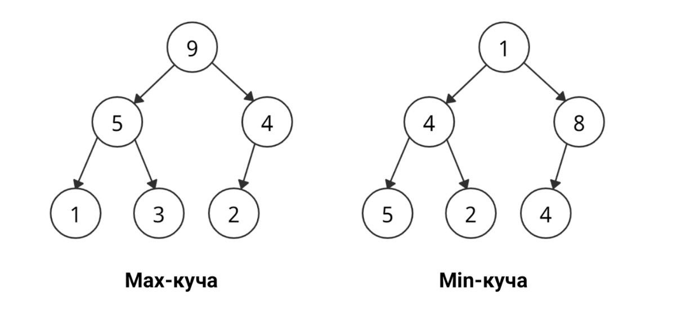

# Куча
>Куча (англ. heap) - это структура данных, которая используется для хранения и управления набором элементов в порядке возрастания или убывания. Она представляет собой дерево, где каждый узел имеет значение, которое больше или равно значениям его потомков. Куча может быть реализована как массив, где каждый элемент является узлом дерева, или как дерево, где каждый узел имеет максимальное количество дочерних узлов.

* Если любой узел всегда больше дочернего узла (узлов), а ключ корневого узла является наибольшим среди всех остальных узлов, это __max-куча__.
* Если любой узел всегда меньше дочернего узла (узлов), а ключ корневого узла является наименьшим среди всех остальных узлов, это __min-куча__.


### Для чего нужны кучи:
Кучи позволяют быстро находить минимальный или максимальный элемент в наборе данных, а также быстро добавлять и удалять элементы. 
### Плюсы куч:
1. Эффективно работают для операций добавления, удаления и поиска элементов.
2. Просты в реализации и поддержке.
3. Подходят для хранения больших объемов данных.
### Минусы куч:
1. Не эффективно работают для операций сортировки и поиска в случае неоднородных данных.
2. Не подходят для хранения данных, которые часто меняются.
## Классическая куча поддерживает следующие операции:
1. Добавить элемент (Сложность: $O(\log n)$)
3. Извлечь максимальный элемент (Сложность: $O(\log n)$) 
## Реализация кучи максимума
Для начала создадим класс для кучи.

```cpp
class MaxHeap {
  int* heap;  // указатель на массив для хранения элементов кучи
  int size;   // количество элементов в куче
  int capacity;  // емкость кучи
}
```
Следующим шагом будет создания метода insert, который будет добавлять элемент в кучу и перестраивать ее.
```cpp
void insert(int value) {  // метод для добавления элемента в кучу
  if (size == capacity) {  // если куча заполнена
    throw "Heap is full";  // выбрасываем исключение
  }
  heap[size] = value;  // добавляем элемент в кучу
  int index = size;  // устанавливаем индекс для сравнения
  while (index > 0 && heap[(index - 1) / 2] <
                          heap[index]) {  // пока не достигнут корень кучи
    swap(heap[index], heap[(index - 1) / 2]);  // меняем местами текущий элемент
                                               // и его родительский элемент
    index = (index - 1) / 2;  // переходим к родительскому элементу
  }
  size++;  // увеличиваем количество элементов в куче
}
```
Далее создаем метод extractMax, который будет извлекать максимальный элемент из кучи.

```cpp
int extractMax() {
  if (size == 0) {          // если куча пуста
    throw "Heap is empty";  // выбрасываем исключение
  }
  int max = heap[0];  // сохраняем максимальный элемент
  heap[0] =
      heap[size -
           1];  // заменяем максимальный элемент на последний элемент в куче
  size--;  // уменьшаем количество элементов в куче
  int index = 0;  // устанавливаем индекс для сравнения
  while (index * 2 + 1 < size) {  // пока есть дочерние элементы
    int childIndex =
        index * 2 + 1;  // определяем индекс левого дочернего элемента
    if (childIndex + 1 < size &&
        heap[childIndex + 1] >
            heap[childIndex]) {  // если есть правый дочерний элемент и он
                                 // больше левого
      childIndex++;  // увеличиваем индекс на правый дочерний элемент
    }
    if (heap[index] >= heap[childIndex]) {  // если текущий элемент больше или
                                            // равен дочернему элементу
      break;  // выходим из цикла
    }
    swap(
        heap[index],
        heap[childIndex]);  // меняем местами текущий элемент и дочерний элемент
    index = childIndex;  // переходим к дочернему элементу
  }
  return max;  // возвращаем максимальный элемент
}

```
Теперь создадим метод getSize, который возвращает количество  элементов в куче.
```cpp
int getSize() { return size; }
```
## Код полностью

```cpp
#include <iostream>
using namespace std;

class MaxHeap {
 private:
  int* heap;     // Указатель на массив кучи
  int size;      // Текущий размер кучи
  int capacity;  // Емкость кучи (максимальный размер)

 public:
  MaxHeap(int capacity) {  // Конструктор класса, инициализирует кучу
    this->capacity = capacity;  // Сохраняем емкость кучи
    heap = new int[capacity];  // Выделяем память для массива кучи
    size = 0;                  // Изначально куча пуста
  }

  ~MaxHeap() {  // Деструктор класса, освобождает память при уничтожении объекта
    delete[] heap;
  }

  void insert(int value) {  // Вставка элемента в кучу
    if (size == capacity) {  // Если куча полная, выбрасываем исключение
      throw "Heap is full";
    }
    heap[size] = value;  // Вставляем элемент в конец кучи
    int index = size;  // Индекс вставленного элемента
    while (index > 0 && heap[(index - 1) / 2] <
                            heap[index]) {  // Пока не нарушается свойство кучи
      swap(heap[index],
           heap[(index - 1) / 2]);  // Меняем элемент с его родителем
      index = (index - 1) / 2;  // Переходим к родителю
    }
    size++;  // Увеличиваем размер кучи
  }

  int extractMax() {  // Извлечение максимального элемента из кучи
    if (size == 0) {  // Если куча пуста, выбрасываем исключение
      throw "Heap is empty";
    }
    int max = heap[0];  // Максимальный элемент - корень кучи
    heap[0] = heap[size - 1];  // Перемещаем последний элемент на место корня
    size--;                    // Уменьшаем размер кучи
    int index = 0;             // Индекс текущего элемента
    while (index * 2 + 1 < size) {  // Пока есть левый потомок
      int childIndex = index * 2 + 1;  // Индекс левого потомка
      if (childIndex + 1 < size &&
          heap[childIndex + 1] >
              heap[childIndex]) {  // Если есть правый потомок и он больше
                                   // левого
        childIndex++;  // Выбираем правого потомка
      }
      if (heap[index] >=
          heap[childIndex]) {  // Если свойство кучи не нарушается
        break;
      }
      swap(heap[index],
           heap[childIndex]);  // Меняем элемент с максимальным потомком
      index = childIndex;  // Переходим к потомку
    }
    return max;  // Возвращаем извлеченный максимальный элемент
  }

  int getSize() {  // Возвращает текущий размер кучи
    return size;
  }

  bool isEmpty() {  // Проверяет, пуста ли куча
    return size == 0;
  }
};

int main() {
  MaxHeap heap(10);  // Создаем объект кучи с емкостью 10
  heap.insert(3);  // Вставляем элементы
  heap.insert(1);
  heap.insert(4);
  heap.insert(1);
  heap.insert(5);
  heap.insert(9);
  heap.insert(2);
  heap.insert(6);
  heap.insert(5);
  cout << "Max: " << heap.extractMax()
       << "\n";  // Извлекаем максимальный элемент
  cout << "Size: " << heap.getSize() << "\n";  // Выводим размер кучи
  cout << "Max: " << heap.extractMax()
       << "\n";  // Извлекаем максимальный элемент
  cout << "Size: " << heap.getSize() << "\n";  // Выводим размер кучи
  cout << "Empty: " << heap.isEmpty() << "\n";  // Проверяем, пуста ли куча
}

```
Вывод:

```bash
Max : 9
Size : 8
Max : 6
Size : 7
Empty : 0
```