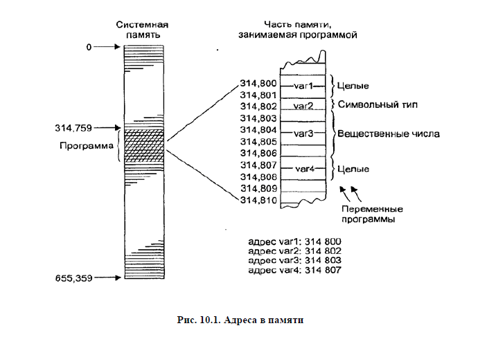
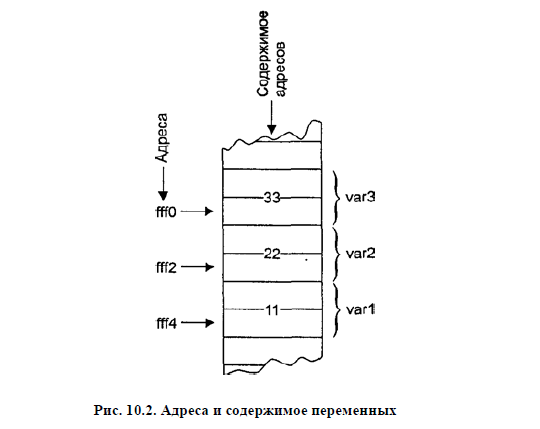

# Указатели 

Адреса переменных в C++
===
Сначала давайте разберемся с тем, зачем нам вообще гипотетически могут пригодиться указатели. 

Самые частые примеры использования указателей:
* доступ к элементам массива
* передача в функцию аргументов, которые требуется изменить
* передача строк и массивов в функции
* выделение памяти
* создание сложных структур, например, связных списков и бинарных деревьев
Вам может показаться, что большую часть операций выше можно сделать и без указателей, и мы обязательно позже рассмотрим разницу в реализации действий без указателей и с ними. Также без указателей невозможны некоторые ключевые возможности C++, такие, как операции new, виртуальные функции и тд, но об этом мы поговорим позже. Сейчас наша главная задача - разобраться с тем, что такое указатели, и как их грамотно применять.

Известным фактом является то, что у каждой переменной есть свой уникальный адрес в памяти. При запуске нашей программы под нее выделяется кусок системной памяти. На рисунке 10.1 показано, как это выглядит.

Давайте рассмотрим операцию получения адреса & на простом примере:
```cpp
#include <iostream>

int main() {
  int var1 = 11;  // определим три переменных
  int var2 = 22;  // и присвоим им некоторые значения
  int var3 = 33;

  cout << &var1 << endl << &var2 << endl << &var3 << endl;
  // выведем адреса всех трех переменных

  return 0;
}
```
Вывод этой программы будет следующим:
```bash
0x8f4ffff4 
0x8f4ffff2 
0x8f4ffff0 
```
Адреса, выводимые с помощью оператора  <<, представляются в шестнадцатеричной системе счисления

>Стоит помнить, что адрес переменной и ее значения - вещи абсолютно разные, что показано на следующей иллюстрации:


Указатели в C++
===
>Переменная, содержащая в себе значение адреса, называется переменной-указателем или просто указателем.

Указатель не имеет тот же тип, что и переменная, адрес которой он хранит. Проще сказать так, существует столько типов указателей, сколько существует типов данных. Есть указатели на int, на float, на char и так далее. Мы не можем иметь тип данных pointer, потому что компилятору необходимо знать, на какой именно тип данных указывает конкретный указатель. Способы создать указатели на разные типы данных:
```cpp
char* cptr;  // указатель на символьную переменную
int* iptr;   // указатель на целую переменную
float* fptr;  // указатель на вещественную переменную
Distance* distptr;  // указатель на переменную класса Distance
```
Напишем простую программу, чтобы проиллюстрировать работу указателей:
```cpp
#include <iostream>

int main() {
  int first_var = 11;
  int second_var = 34;  // создали две переменные и присвоили им значения

  std::cout << &first_var << "\n"
            << &second_var << "\n";  // вывели адреса двух переменных

  int* first_pointer = &first_var;  // создали указатель на int и присвоили
                                    // значения адреса первой переменной
  int* second_pointer = &second_var;  // создали указатель на int и присвоили
                                      // значения адреса второй переменной

  std::cout << first_pointer << "\n"
            << second_pointer << "\n";  // вывели значения двух указателей
}
```
```bash
0x8f51fff4- адрес переменной var1 
0x8f51fff2- адрес переменной var2
0x8f51fff4- значение ptr равно адресу переменной var1 
0x8f51fff2- значение ptr равно адресу переменной var2
```
>Важно проверять, что перед использованием указателя ему было присвоено значения. В противном случае указатель будет хранить случайный адрес и ломать вашу программу, причем компилятор не будет на это жаловаться, а найти такую ошибку в большом коде стоит титанических усилий.

Доступ к переменной по указателю
===

Допустим, вы забыли имя переменной, но помните ее адрес, сможете ли вы получить значение этой переменной? Да, сможете, и в этом вам поможет указатель. Вы присвоите указателю адрес это переменной, а для доступа к значению будете использовать операцию разыменовывания. Давайте поэтапно разберемся с тем, как это будет происходить.
```cpp
#include <iostream>

int main() {
  int first_var = 11;  // наша переменная

  int* ptr = &first_var;  // создали указатель на нашу переменную

  std::cout << *ptr;  // вывели значние через указатель
}
```
Вывод данной программы будет содержать единственное число 11.

>Операция `*` - операция разыменовывания указателя, которая дает доступ к данным, хранящимся по адресу, на который указывает указатель. В данном случае `*ptr` - не что иное, как получение значения по адресу `ptr`. Это называется непрямым доступом или же разыменовыванием указателя.
 
Указатель можно использовать не только для получения значения переменной, на которую он указывает, но и для выполнения действий с этой переменной.
```cpp
#include <iostream>

int main() {
  int first_var = 11;
  int second_var = 56;

  int* first_ptr = &first_var;  // указатель на первую переменную

  *first_ptr += 7;  // увеличили данные, лежащие по адресу first_ptr на 7
  second_var = *first_ptr;  // то же самое, что и second_var = first_var

  std::cout << second_var;  // вывели значение второй переменной
}
```
Вывод данной программы будет содержать единственное число 18.

Запомните, что звездочка, используемая в операции разыменования, &mdash; это не то же самое, что звездочка, используемая при объявлении указателя. Операция разыменования предшествует имени переменной и означает значение, находящееся в переменной, на которую указывает указатель. Звездочка же в объявлении указателя означает указатель на. 
```cpp

int* ptr;   // обьявление: указатель на int
*ptr = 37;  // разыменование: значение переменной, адресованной через ptr
```

> При присваивании одному указателю значения другого указателя важно следить, чтобы они указывали на одинаковые типы.

Обращение к элементам массива через указатели
===
Помимо обращения к элементам массива через их индексы, возможно обращение через адреса каждого из элементов.
При помощи выражения *(array + j) происходит обращение к элементу массива array с названием j. Это работает, потому что в данном случае array без квадратных скобок представляет собой адрес первого элемента массива, а `+ j` означает что элемент имеет сдвинутый на j ячеек массива от первого элемента адрес. То есть *(array + 5) берет адрес элемента, который сдвинут на 5 ячеек от адреса первого элемента массива, и производит операцию разыменовывания указателя. Таким образом через указатель мы получаем доступ к элементам массива
```cpp
// доступ к элементам массива через указатель
#include <iostream>

int main() {
  int intarray[5] = {31, 54, 77, 52, 93};  // массив целых чисел

  for (int j = 0; j < 5; j++) {  // для каждого элемента массива
    cout << *(intarray + j)
         << "\n";  // напечатаем его значение, обратившись через указатель
  }
}
```
Подробнее про работу массивами(сортировка с использованием указателей), создание строк с помощью указателей и т.д., вы можете прочитать в [книге Лафоре по плюсам](http://lib.jizpi.uz/pluginfile.php/7322/mod_resource/content/0/Объектно_ориентированное_программирование_в_С%2B%2B_Р_Лафоре.pdf) на страницах 424 - 471(или всю главу про указатели, начиная со страницы 411)

